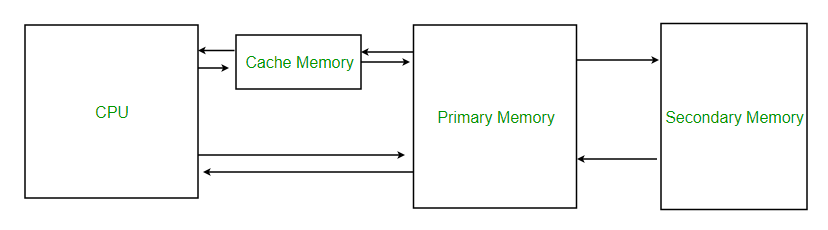

#### Acceleration of Memory Access

##### A. Explanation of how cache reduces average memory access time

Cache memory acts as a temporary storage area between the CPU and the main memory for quick memory access. Using the concept of locality to decide which information to store in the cache, the computer system can efficiently and conveniently access that information from the cache and reduce the average memory access time.

<a href="https://www.geeksforgeeks.org/cache-memory-in-computer-organization/">
   

##### B. Benefits of storing frequently accessed data in cache

There are many benefits to storing frequently accessed data in the cache but the main ones would include:
- Improved Performance
  - Due to the nature of caches having reduced latency than other forms of memory, the quicker responses improves efficiency of data retrieval.
- Helps evaluate computer performance
  - As explained above, it uses the cache’s hit-to-miss ratio to evaluate performance, a higher hit rate would signify better performance and vice versa
- Lower Resource Utilisation
  - If frequently accessed data are stored in the cache, there is no need to allocate resources to find the required information in the primary or secondary storage and can instead be used for other tasks needed.
   

##### C. Exploiting locality for faster data retrieval

Locality refers to the various situations that make a system predictable and uses it to improve a computer’s performance. The situations are then used to create patterns of memory access to be relied on by the cache memory. The two types of locality are:
- Temporal Locality
  - Refers to the tendency an address may be accessed again in the near future due to the initial accessing of the address
  - Analogy:
- Spatial Locality
  - Refers to the nearby addresses that may be accessed in the near future due to the accessing of one address
  - Analogy:
 
Using the locality of reference, through the potential frequency of access or the close proximity of addresses, faster data retrievals are made possible.

     
###### By Velez Hans Josef Tuble (56203178)
   
[Back to Table of Contents](../table_of_contents.md) | [Back to Home Page](../index.md)
