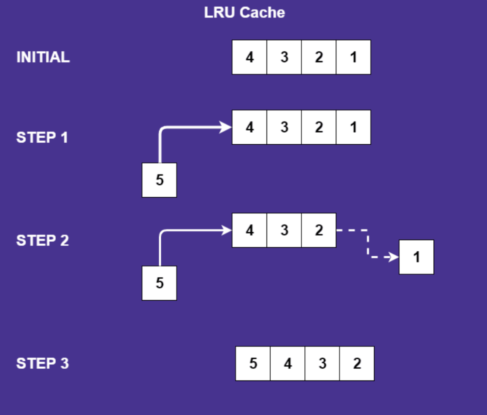

# Cache Algorithms

### A. LRU, LFU and Random

LRU, LFU, and random are the common cache replacement policies. 

**LRU (Least Recently Used)**  
LRU represents the least recently used algorithm and it is one of the most famous algorithms. The name LRU, implies that it keeps the least recently used objects at the top and evicts objects that have not been used when the list reaches the maximum capacity.
- Benefits
  - It is fast and efficient in the view of cache management. The high-efficiency benefits for the applications that need quick access to used data.
  - LRU is able to work well with data subject to locality concerns, showing that it is effective for applications where recently accessed items are likely to be accessed again soon. This attribute makes it suitable for applications with temporal locality.
- Drawbacks
  - It would perform poorly when element files are accessed occasionally but consistently while other elements are accessed very frequently for a short duration and never accessed again. It would lead to inefficiency of cache utilization.
  - A larger cache size is required to boost the efficiency.

**LFU (Least Frequently Used)**  
LFU means the least frequently used algorithm and it monitors how many times it was accessed. Each object is associated with a counter which counts how many times it was accessed. If the list reaches the maximum capacity, objects with the lowest counters are evicted.
- Benefits
  - Cache pollution can be avoided by evicting items that are accessed once or rarely, regardless of their recency.
  - It can keep items that are accessed more often than others and can manage cyclic access patterns better than LRU.
- Drawbacks
  - It would be ineffective for applications with evolving access patterns as the items that were popular in the past may not be popular in the present or future.
    
**Random**  
In a random algorithm, it works very simple. It randomly selects an object and evicts it when it reaches maximum capacity. Every cache entry has the same probability of being replaced.
- Benefits
  - It is easy and simple to implement because it does not keep references or the history of the items.
- Drawbacks
  - It would lead to suboptimal cache performance by comparing with other complicated policies. It does not take the usage pattern or the possibility of future access into account.
 
Every algorithm contains its advantages and disadvantages in using it, people should use it depending on the specific needs of the system.

### B. Impact of cache algorithms on cache hit rates
The cache algorithms are crucial in affecting the cache hit rates. The cache replacement policy determines which object to be evicted if a new object is inserted. The LRU and LFU would enhance the possibility of cache hits as they keep recently accessed data and frequently used data. The random replacement would result in poor hit rates due to the random nature of eviction.

| [Back to Table of Contents](../table_of_contents.md) |
| [Back to Home Page](../index.md) |
