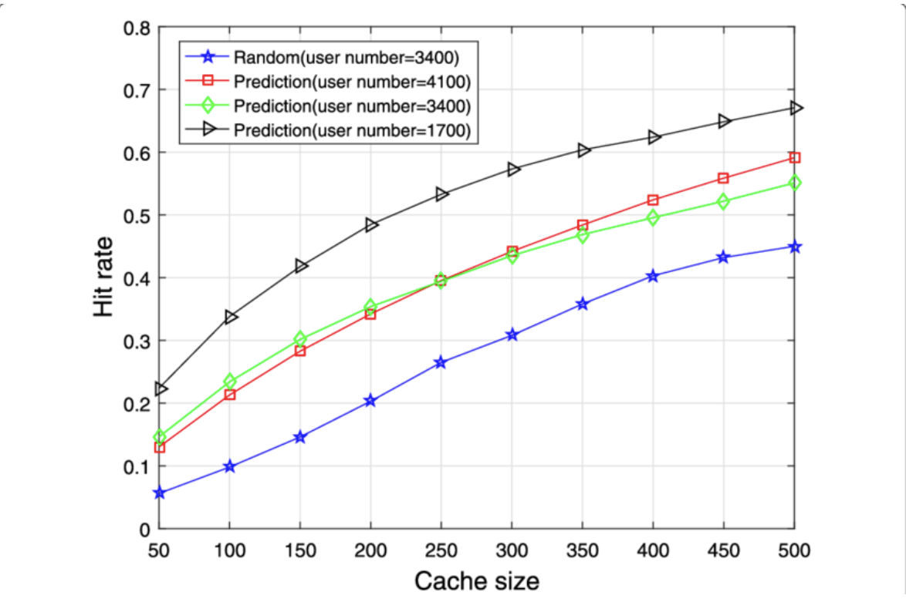
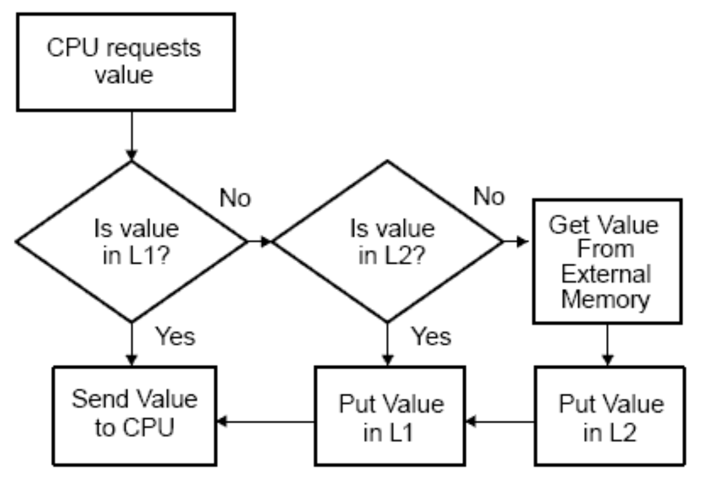
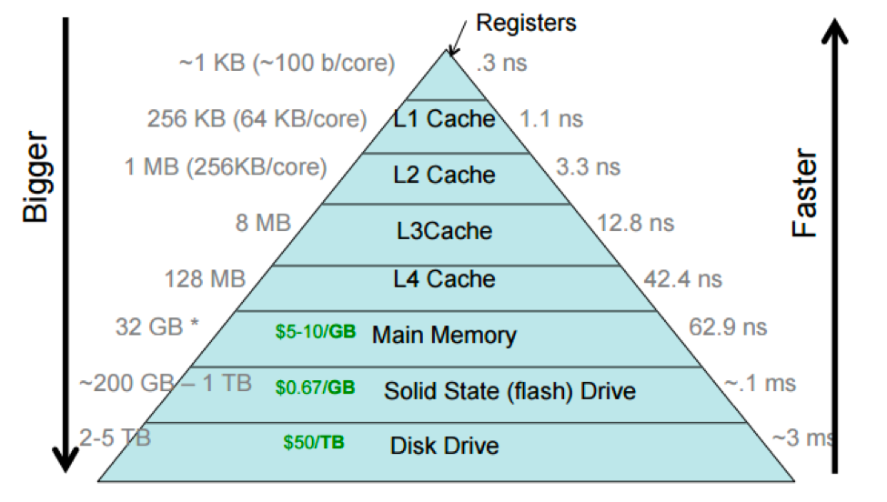

<body>
<h4><b>Cache Hierarchy</b></h4>

<h5><b>A. Overview of Cache Hierarchy with Multiple Levels (L1, L2, L3)</b></h5>

Cache hierarchy consists of multiple cache levels, typically known as L1, L2, and L3 caches. Each cache level has different capacity, access time, and proximity to the CPU.

  

<li><b>L1 Cache</b>: The closest cache to the CPU, consisting of separate instruction and data caches. It features the smallest capacity but the least latency. It stores frequently accessed data and instructions. </li> 

<li><b>L2 Cache</b>: The secondary cache with a larger capacity but higher latency, it acts as a mediator between the L1 cache and the main memory. It stores additional data to reduce the need for main memory access. </li> 

<li><b>L3 Cache</b>: The highest cache level with the largest capacity and highest latency, it is typically shared among multiple cores or processors in a multi-core system. </li>

   

<h5><b>B. Trade-offs between Cache Size, speed, and Proximity to CPU</b></h5>

Cache hierarchy involves trade-offs among cache size, speed, and proximity to the CPU.   

Larger cache sizes can accommodate more data, and thereby raises the chances of cache hits and reduces cache misses. However, they also require more transistors and it leads to higher costs. Designers face the challenge of balancing cache size, cost, and expected benefits from improved performance. Different cache organizations, including direct-mapped, fully associative, or set-associative, have different trade-offs between capacity and access time.

 

<li><b>Direct-mapped Cache</b>: Each memory block maps to a specific cache location, resulting in simple hardware but potential conflicts. </li> 

<li><b>Fully Associative Cache</b>: Any memory block can be stored in any cache location, reducing conflicts but increasing hardware complexity and access time. </li> 

<li><b>Set Associative Cache</b>: The cache is divided into multiple sets and allows each memory block to be mapped to any location within its set. It strikes a balance between direct-mapped and fully associative caches. It reduces conflicts while maintaining lower access time compared to fully associative caches. </li>

   

For aches located closer to the CPU, like the L1 cache, have lower latency and faster access time. As caches move further away from the CPU, such as the L2 and L3 caches, latency increases. This trade-off between speed and proximity is influenced by factors like cache organization, technology, and chip layout.  

   

<h5><b>C. Retrieval process in Cache Hierarchy</b></h5>

  

If data is not found in the L1 cache (cache miss), the CPU will check the larger but slower L2 cache. If the data is found in the L2 cache (cache hit), it will be fetched and sent to the CPU. This eliminates the need for main memory access.    

If data is not found in the L2 cache (cache miss), the CPU will check the L3 cache or the main memory. The L3 cache, if available, acts as a larger shared cache for multiple cores. If the data is found in the L3 cache (cache hit), it will be retrieved and forwarded to the CPU.    

If the data is absent in any cache level (cache miss), it has to be fetched from the main memory, resulting in a cache miss penalty. The cache hierarchy aims to exploit the principle of locality and minimize memory access. By keeping frequently accessed data in faster cache levels, the CPU significantly reduces data access times and enhances the system performance.    

<a href="(https://www.edn.com/optimizing-for-cache-performance-part-1/)">

 

The cache hierarchy is designed in this way to exploit the principle of locality, which states that programs tend to access data and instructions that are spatially or temporally close to each other. By storing frequently accessed data in the smaller and faster cache levels, the CPU can significantly reduce the time required to access data and improve overall system performance.  

     
<h6>By Lo Wing Sze (55678893)</h6>h6>
   

<a href="https://cs1102proj-cache.github.io/CS1102/contents/principles_of_cache_operation.html">Previous: Principles of Cache Operation</a> |
<a href="https://cs1102proj-cache.github.io/CS1102/contents/cache_algorithms.html">Next: Cache Algorithms</a>
  
