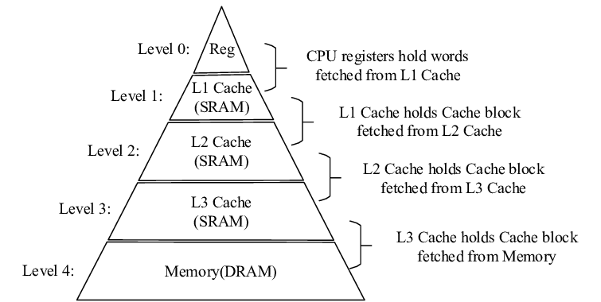

# Cache Hierarchy

### A. Overview of cache hierarchy with multiple levels (L1, L2, L3)

Cache hierarchy consists of multiple levels of cache, typically referred to as L1, L2, and L3 caches. Each level of the cache hierarchy has different capacities, speeds, and proximity to the CPU.

The L1 cache, also known as the primary cache, is the closest cache to the CPU. It has the smallest capacity but the lowest latency (access time). The L1 cache stores frequently accessed data and instructions required by the CPU. For example, in the Intel x86 architecture, the L1 cache is split into separate instruction and data caches.

The L2 cache, also known as the secondary cache. It is larger in capacity but has higher latency compared to the L1 cache. The L2 cache acts as a mediator between the L1 cache and the main memory. It stores additional data and instructions that are not present in the L1 cache, thereby reducing the frequency of accessing the main memory and improving overall performance.

The highest level in the cache hierarchy is the L3 cache, which is a shared cache serving multiple cores or processors in a multi-core system. It has a larger capacity compared to the L1 and L2 caches but generally has higher latency. The L3 cache is often integrated on the processor chip or placed on a separate chip. Its purpose is to provide a larger cache capacity and shared resource for multiple cores, improving their access to frequently used data and reducing cache conflicts.

### B. Trade-offs between cache size, speed, and proximity to CPU

Cache hierarchy involves trade-offs between cache size, speed, and proximity to the CPU.

Larger cache sizes can accommodate more data, increasing the likelihood of cache hits and reducing cache misses. However, larger caches also require more transistors and incur higher costs. Designers must strike a balance between cache size, cost, and the expected benefits in terms of improved performance. Different cache organizations, such as direct-mapped, fully associative, or set-associative, have different trade-offs between capacity and access time.

Caches closer to the CPU, such as the L1 cache, have lower latency and faster access times. As caches move further away from the CPU, such as the L2 and L3 caches, the latency increases. This trade-off between speed and proximity is influenced by factors like cache organization, technology, and chip layout.

### C. Retrieval process in cache hierarchy

The retrieval process in the cache hierarchy follows a hierarchical structure. When the CPU needs data or instructions, it first checks the L1 cache for the required data. This step is known as a cache hit, where the data is quickly accessed, reducing memory latency.

If the data is not found in the L1 cache (cache miss), the CPU proceeds to check the L2 cache. The L2 cache is larger but slower than the L1 cache. If the data is present in the L2 cache (cache hit), it is fetched and provided to the CPU, reducing the need to access the main memory.

If the data is not found in the L2 cache (cache miss), the CPU checks the L3 cache or main memory. The L3 cache, if available, serves as a larger shared cache for multiple cores. If the data is found in the L3 cache (cache hit), it is retrieved and forwarded to the CPU.

If the data is not present in any level of the cache hierarchy (cache miss), it must be fetched from the main memory, incurring a cache miss penalty. This retrieval process aims to minimize memory access time by storing frequently accessed data at levels closer to the CPU, reducing the need to access slower main memory and improving overall system performance.

The hierarchical structure of the cache hierarchy allows for faster data retrieval by exploiting the principle of locality. Frequently accessed data is more likely to be found in the lower levels of the hierarchy, closer to the CPU, while less frequently accessed data is stored in higher-level caches or main memory. This organization helps to reduce the average memory access time and improve system performance.
